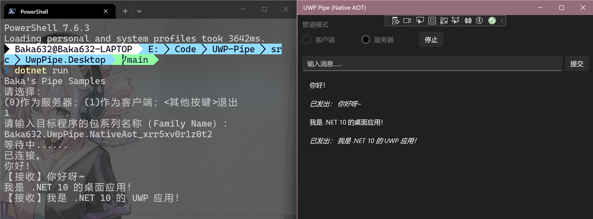
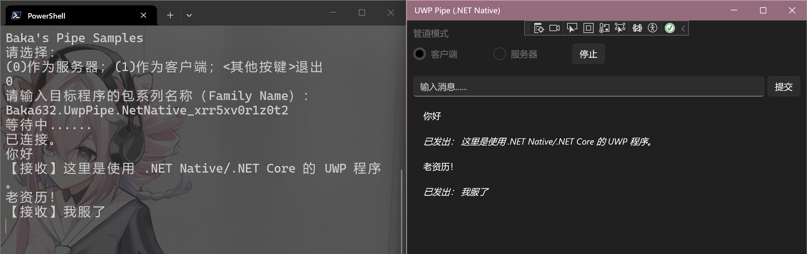
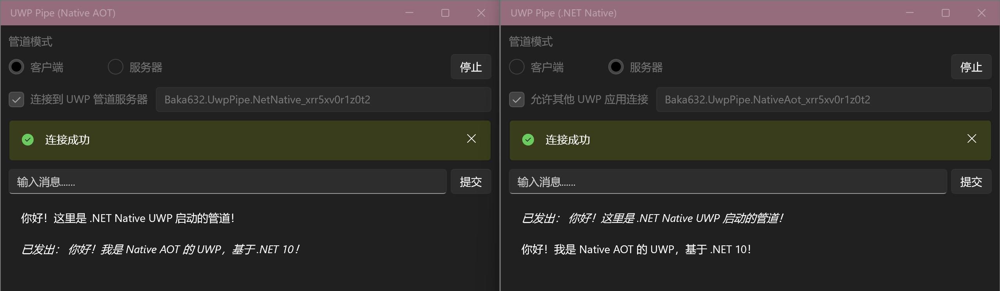
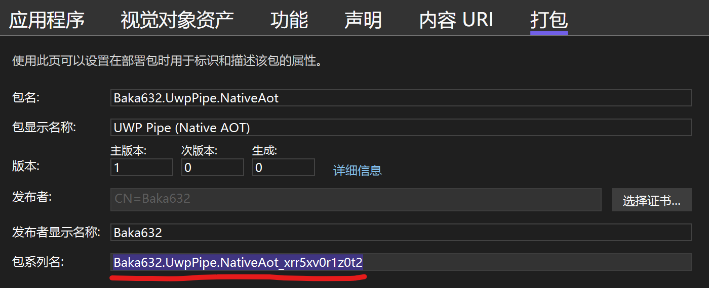

[中文](README.md)

# UWP Pipe

This project demonstrates pipe communication between UWP (including UWP using .NET 10) and other processes (including desktop applications and other UWP apps).

## Screenshots







## Technical Highlights

### Common Operation: Obtain the Packaged App’s SID (Security Identifier)

This project obtains the SID via the package family name of the packaged app.

The package family name can be found in the `Package.appxmanifest` under the "Packaging" tab.



Then, pass the package family name to the [DeriveAppContainerSidFromAppContainerName](https://learn.microsoft.com/windows/win32/api/userenv/nf-userenv-deriveappcontainersidfromappcontainername) function to retrieve the SID of the packaged app.

This project uses CsWin32 to generate the P/Invoke code for calling `DeriveAppContainerSidFromAppContainerName`.

The obtained result is a pointer, which can be converted to a `SecurityIdentifier` object and a string as follows for later use:

```csharp
// Package family name of the target UWP app.
string packageFamilyName = "Baka632.UwpPipe.NativeAot_xrr5xv0r1z0t2";
// The following P/Invoke code is generated by CsWin32.
PInvoke.DeriveAppContainerSidFromAppContainerName(packageFamilyName, out PSID psid).ThrowOnFailure();
unsafe
{
    SecurityIdentifier packageSid = new((nint)psid.Value);
    string packageSidSddl = packageSid.ToString();
    // After use, FreeSid must be called to release the PSID; this does not affect the already created SecurityIdentifier object.
    PInvoke.FreeSid(psid);
}
```

#### Special Notes for .NET Native‑Based UWP Apps

.NET Native‑based UWP apps do not include the `SecurityIdentifier` class themselves, so we need to install the `System.Security.Principal.Windows` package.

However, if we reference the latest version 5.0.0 of `System.Security.Principal.Windows`, dependency conflicts will occur, causing the app to crash.

Therefore, we must use version 4.7.0 of `System.Security.Principal.Windows` instead, which works without issues.

### Creating a Pipe

Both desktop applications and UWP applications create pipes in a similar way, using `NamedPipeServerStream`.

However, when a UWP application creates a pipe, the pipe name must start with `LOCAL\`, for example:

```csharp
string pipeName = "Baka632-Pipe"; // Pipe name.
NamedPipeServerStream stream = new NamedPipeServerStream($@"LOCAL\{pipeName}", PipeDirection.InOut, 1, PipeTransmissionMode.Byte, PipeOptions.Asynchronous)
```

A pipe created this way can be accessed by desktop applications without permission issues, but other UWP applications cannot access it. Therefore, you need to configure an access control list (ACL) for this pipe.

This can be done via the `NamedPipeServerStreamAcl` class to create a `NamedPipeServerStream` with an ACL.

When configuring, you need to grant access rights using both the packaged app’s SID and the current user’s SID.

```csharp
PipeSecurity access = new();
SecurityIdentifier packageSid; // Previously obtained packaged app SID.
string pipeName; // Pipe name. If created by UWP, add the "LOCAL\" prefix.
SecurityIdentifier currentUserSid = WindowsIdentity.GetCurrent().Owner ?? throw new InvalidOperationException("Cannot get the current process SID.");

// Permissions can be configured as needed; this project allows read and write.
PipeAccessRights rights = PipeAccessRights.Read | PipeAccessRights.Write;
access.AddAccessRule(new PipeAccessRule(packageSid, rights, AccessControlType.Allow));
access.AddAccessRule(new PipeAccessRule(currentUserSid, rights, AccessControlType.Allow));
NamedPipeServerStream pipeStream = NamedPipeServerStreamAcl.Create(
    pipeName, PipeDirection.InOut, 1, PipeTransmissionMode.Byte,
    PipeOptions.Asynchronous, 512, 512,
    access, HandleInheritability.None);
```

#### Special Notes for .NET Native‑Based UWP Apps

Members such as `PipeSecurity`, `PipeAccessRights`, and `NamedPipeServerStreamAcl` are not available in .NET Native UWP apps.

A workaround is to use the `NamedPipeServerStream.NetFrameworkVersion` package, which references the necessary dependencies to resolve most missing members.

However, `NamedPipeServerStreamAcl` is still unavailable; in this case, you can use the `NamedPipeServerStreamConstructors.New` method provided by this package to construct a pipe with an ACL.

Additionally, you should use version 1.0.10 of the `NamedPipeServerStream.NetFrameworkVersion` package, again due to versioning issues with `System.Security.Principal.Windows`.

### Accessing a Pipe

If the pipe is created by a desktop application, both desktop and UWP applications can open the pipe directly (the pipe name does not need the `LOCAL\` prefix).

```csharp
string pipeName = "Baka632-Pipe"; // Pipe name.
NamedPipeClientStream stream = new NamedPipeClientStream(".", pipeName, PipeDirection.InOut, PipeOptions.Asynchronous)
```

If the pipe is created by a UWP application, you need to obtain the SID of that UWP package, and then construct the pipe name as shown below (the pipe name also does not need the `LOCAL\` prefix):

```csharp
SecurityIdentifier packageSid; // Previously obtained packaged app SID.
string pipeName = "Baka632-Pipe"; // Pipe name.
int sessionId = Process.GetCurrentProcess().SessionId;
string pipeFullName = $@"Sessions\{sessionId}\AppContainerNamedObjects\{packageSid}\{pipeName}";
NamedPipeClientStream client = new(".", pipeFullName, PipeDirection.InOut, PipeOptions.Asynchronous);
```

After that, normal communication can proceed.

#### Special Notes for .NET Native‑Based UWP Apps

In .NET Native‑based UWP apps, obtaining the session ID via the `Process.GetCurrentProcess().SessionId` property is not feasible. Although the API exists, calling it will unconditionally throw an exception (the platform does not support it).

We need to P/Invoke the `GetCurrentProcessId` function to get the current process PID, and then call `ProcessIdToSessionId` to obtain the session ID:

```csharp
public static int? GetCurrentSessionIdNative()
{
    uint pid = PInvoke.GetCurrentProcessId();

    return PInvoke.ProcessIdToSessionId(pid, out uint sessionId)
        ? (int)sessionId
        : null;
}
```

## Acknowledgements

The following resources have been helpful to this project:

- [hannesne/NamedPipesSample](https://github.com/hannesne/NamedPipesSample)

## License

MIT License.